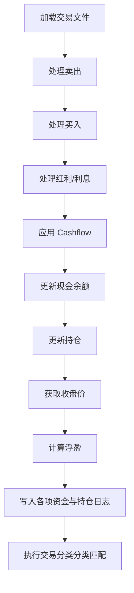

# Post-Trade 批量处理使用指南

## 概览

Post-Trade 脚本用于处理实盘交易数据：从交易软件导出文件中读取成交记录，更新持仓、现金余额和日志。

**本脚本与预测、融合、回测等模块完全解耦，不依赖任何模型输出。**

| 脚本 | 用途 |
|------|------|
| `prod_post_trade.py` | 批量处理交易日数据，更新持仓和资金 |

---

## 文件结构

```text
QuantPits/
├── quantpits/
│   ├── scripts/
│   │   └── prod_post_trade.py          # 本脚本
│   └── docs/
│       └── 04_POST_TRADE_GUIDE.md        # 本文档
│
└── workspaces/
    └── <YourWorkspace>/                  # 激活的隔离工作区
        ├── config/
            ├── prod_config.json        # 持仓/现金/处理状态
        │   └── cashflow.json             # 出入金记录
        └── data/
            ├── YYYY-MM-DD-table.xlsx     # 交易软件导出文件（每日一个，当前来源：国泰君安交割单脱敏导出）
            ├── emp-table.xlsx            # 空模板（无交易日使用）
            ├── trade_log_full.csv        # 交易日志（累计）
            ├── trade_detail_YYYY-MM-DD.csv # 每日交易详情
            ├── trade_classification.csv  # 交易分类打标（累计：量化信号、替代、手工）
            ├── holding_log_full.csv      # 持仓日志（累计）
            └── daily_amount_log_full.csv # 每日资金汇总（累计）
```

---

## Cashflow 配置

### 新格式（推荐）

`config/cashflow.json` 支持按日期指定多次出入金：

```json
{
    "cashflows": {
        "2026-02-03": 50000,
        "2026-02-06": -20000
    }
}
```

- **正数** = 入金（向账户转入资金）
- **负数** = 出金（从账户转出资金）
- 仅在对应日期的处理中生效

### 旧格式（向后兼容）

```json
{
    "cash_flow_today": 50000
}
```

旧格式会将全部金额应用到批次的**第一个交易日**。

### 处理后归档

处理完成后，已处理的 cashflow 条目会从 `cashflows` 移动到 `processed` 子键：

```json
{
    "cashflows": {},
    "processed": {
        "2026-02-03": 50000,
        "2026-02-06": -20000
    }
}
```

---

## 运行方式

```bash
cd QuantPits

# 正常运行：处理上次处理日到今天的所有交易日
python quantpits/scripts/prod_post_trade.py

# 仅预览：查看会处理哪些日期和 cashflow，不写入任何文件
python quantpits/scripts/prod_post_trade.py --dry-run

# 指定结束日期
python quantpits/scripts/prod_post_trade.py --end-date 2026-02-10

# 详细输出：显示每笔交易明细
python quantpits/scripts/prod_post_trade.py --verbose
```

---

## 处理逻辑

对每个交易日，脚本按以下顺序处理：



### 现金更新公式

```
cash_after = cash_before + 卖出收入 - 买入支出 + 红利利息 + cashflow
```

### 数据文件说明

| 文件 | 内容 | 更新方式 |
|------|------|----------|
| `trade_log_full.csv` | 全部交易记录 | 追加 + 去重 |
| `trade_classification.csv` | 核心量化/手工买卖归因打标 | 自动依赖建议文件推算 |
| `holding_log_full.csv` | 每日持仓快照 | 追加 + 去重 |
| `daily_amount_log_full.csv` | 每日资金汇总 | 追加 + 去重 |
| `trade_detail_*.csv` | 单日交易详情 | 每日覆写 |

### 券商交割单数据约定 (以国泰君安为例)

系统直接通过 pandas 原生读取 `YYYY-MM-DD-table.xlsx`，由于各家券商导出的表头结构不尽相同，目前的处理逻辑高度适配**国泰君安交割单导出格式**。
核心代码读取行为：
*   **Sheet 名称**：默认读取 `Sheet1`
*   **前置跳过**：默认跳过前 5 行无用表头 (`skiprows=5`)
*   **关键列保留**：为了防止代码转数字后丢失前导零，程序强制将 `证券代码` 列读取为 String 格式，并剥离掉可能附带的 `\t` 等制表符。
*   **行为识别**：程序内定 `上海A股普通股票竞价卖出`, `深圳A股普通股票竞价卖出` 为系统合法 `SELL_TYPES`；而 `...买入` 为合法 `BUY_TYPES`。红利和税务扣款也有专门的字段映射（详见代码顶部的 `INTEREST_TYPES`）。

---

## 典型工作流

### 场景 1：例行处理

```bash
# 1. 将交易软件导出文件放入 data/ 目录，命名为 YYYY-MM-DD-table.xlsx
# 2. 如有出入金，编辑 config/cashflow.json
# 3. 运行脚本
python quantpits/scripts/prod_post_trade.py
```

### 场景 2：两次处理之间有多次出入金

```bash
# 编辑 cashflow.json，按日期填写每次出入金
cat config/cashflow.json
# {"cashflows": {"2026-02-03": 50000, "2026-02-06": -20000}}

# 预览确认
python quantpits/scripts/prod_post_trade.py --dry-run

# 确认无误后执行
python quantpits/scripts/prod_post_trade.py
```

### 场景 3：先预览再执行

```bash
# 查看处理计划
python quantpits/scripts/prod_post_trade.py --dry-run
# → 显示将处理的日期列表和 cashflow

# 确认后实际运行
python quantpits/scripts/prod_post_trade.py
```

---

## 完整参数一览

```
python quantpits/scripts/prod_post_trade.py --help

可选参数:
  --end-date TEXT   结束日期 (YYYY-MM-DD)，默认为今天
  --dry-run         仅打印处理计划，不写入任何文件
  --verbose         详细输出每日交易明细
```

---

## 注意事项

> [!IMPORTANT]
> 本脚本**仅处理实盘交易数据**，与训练 (`prod_train_predict.py`)、预测 (`prod_predict_only.py`)、回测 (`brute_force_ensemble.py`) 等模块完全独立，互不耦合。

> [!TIP]
> 建议在正式运行前先用 `--dry-run` 确认处理计划，特别是有 cashflow 的情况。

> [!WARNING]
> 交易文件命名必须严格遵循 `YYYY-MM-DD-table.xlsx` 格式，否则脚本会使用空模板处理该日。
